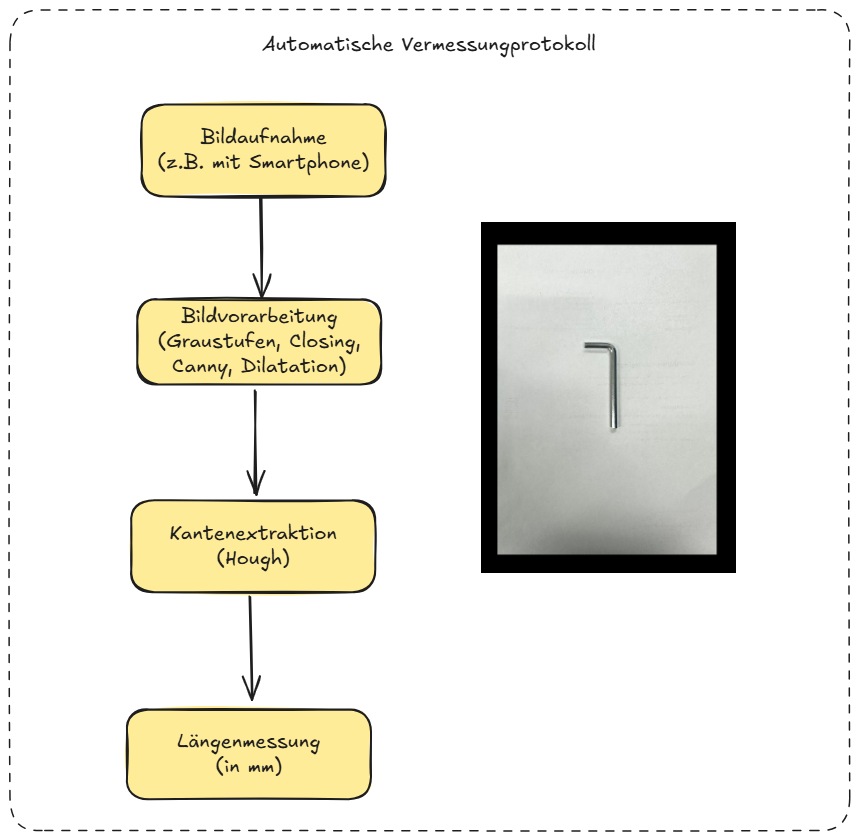

# Automatische Objektvermessung mit OpenCV

Dieses Projekt hat zum Ziel, metallische Werkstücke (z.B. Inbusschlüssel) automatisiert anhand eines Kamerabilds auszumessen.

## Installation & Setup

1. **Virtuelle Umgebung erstellen**  
   ```bash
   python -m venv venv
   source venv/bin/activate  # Linux/Mac
   venv\Scripts\activate     # Windows
   ```

2. **Benötigte Bibliotheken installieren**
   ```bash
   pip install opencv-python matplotlib numpy
   ```

## Problemstellung

In modernen Fräsmaschinen kann ein falsch dimensionierter Rohling zur Kollision mit der Spindel führen – dies verursacht teure Schäden. Ziel ist es daher, eine automatische „**Smarte Aufspannkontrolle**“ zu entwickeln, die:

- Werkstücke auf Bildern erkennt,
- deren Kantenlängen misst,
- und das Ergebnis in **Millimeter** ausgibt.

## Vorgehensweise




## Besonderheiten

- Die größte Herausforderung besteht in der präzisen Vermessung von asymmetrischen Objekten wie einem Inbusschlüssel.
- Lichtverhältnisse und Bildschärfe haben entscheidenden Einfluss auf die Genauigkeit der Ergebnisse.
- Erweiterbar mit Kalibrierung über bekannte Objekte (z.B. Münze, Papierkante).